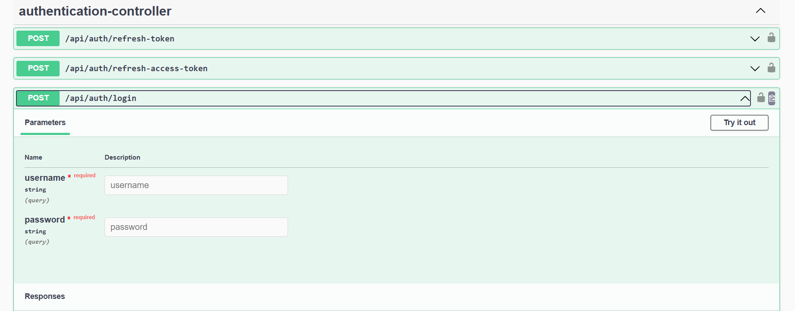
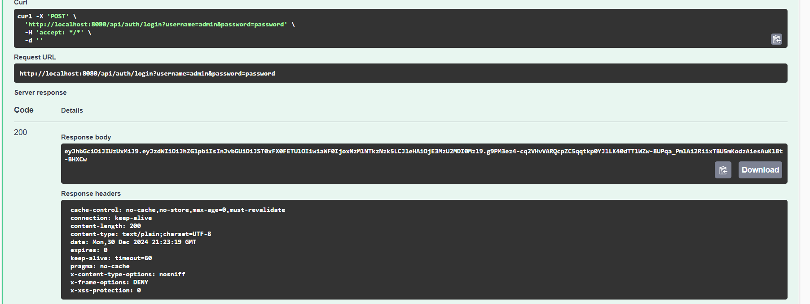
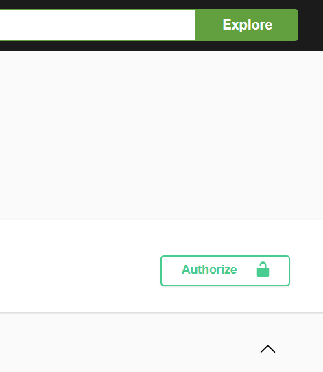
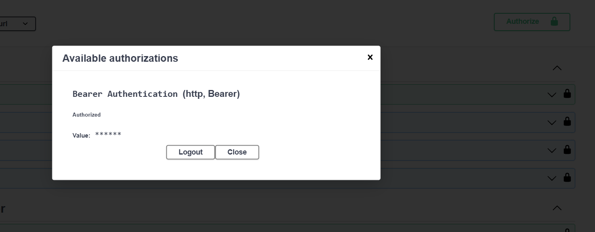
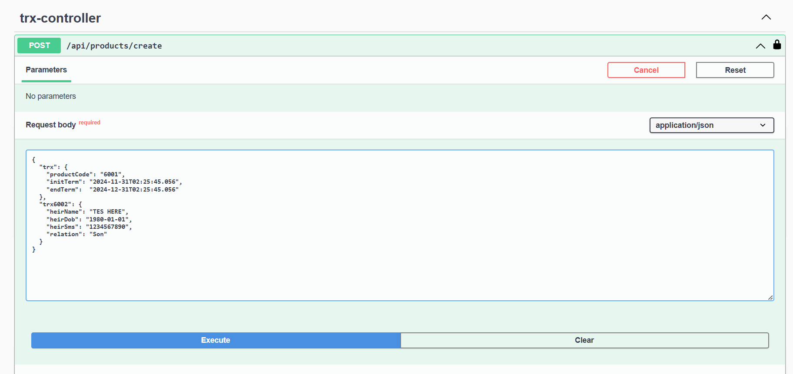
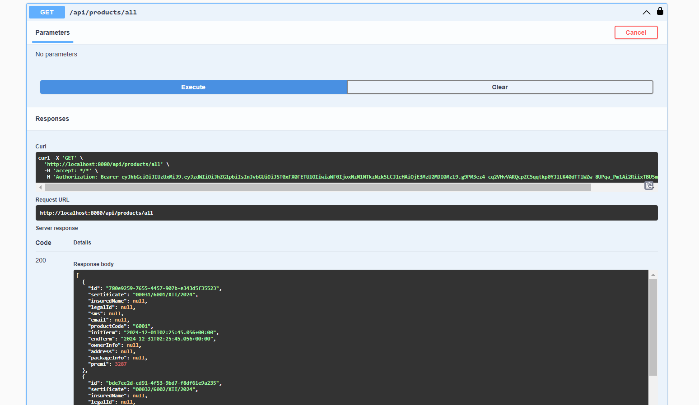
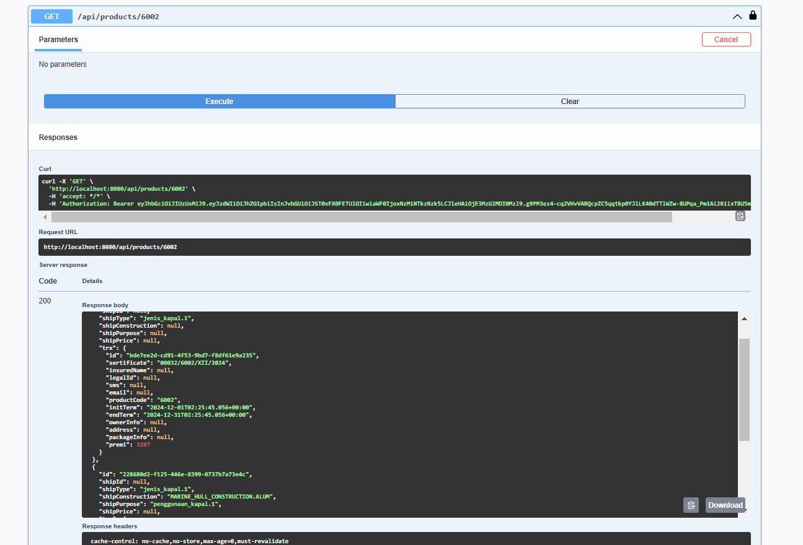
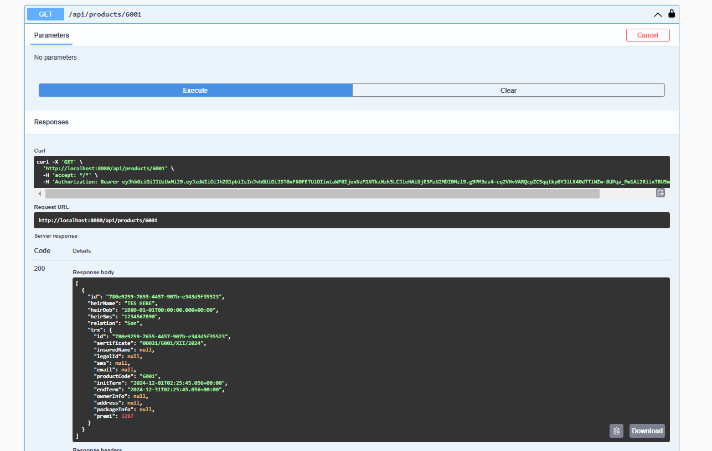

mvn clean install  (to install) <br>
then<br>
mvn spring-boot:run (to run) 

for swagger docs
http://localhost:8080/swagger-ui/index.html


to get jwt use  <br>
username : admin <br>
password : password


copy the token and add it to Authorize logo in the top right of swagger ui


<br> put the token from previous request as a value

<br> 
after that go to  create products/create endpoint to add new trx to product


```
example of payload trx6001
{
  "trx": {
    "productCode": "6001",
    "initTerm": "2024-11-31T02:25:45.056",
    "endTerm":  "2024-12-31T02:25:45.056"
  },
  "trx6001": {
    "heirName": "Ini 6001",
    "heirDob": "1980-01-01",
    "heirSms": "1234567890",
    "relation": "Son"
  }
}
```
```

example of payload trx6002
{
  "trx": {
    "productCode": "6002",
    "initTerm": "2024-11-31T02:25:45.056",
    "endTerm":  "2024-12-31T02:25:45.056"
  },
  "trx6002": {
    "shipType": "jenis_kapal.1",
    "shipConstruction": "MARINE_HULL_CONSTRUCTION.ALUM",
    "shipPurpose": "penggunaan_kapal.1"
  }
}

```
endpoint to get all trx



endpoint to get trx of 6002



endpoint to get trx of 6001



THINGS DONE SUCCESSFULLY
- migrating db table and rows from gdrive (DDL DML)
- implementing jwt auth
- sign user's role to jwt credentials
- use one endpoint for any product code
- generate certificate number
- calculate the premi amount
- save new data
- read data
- utilizing swagger

THINGS NOT YET TO BE DONE
- endpoint access specific for each role (can be done in SecurityConfig by declaring each role is allowed to access what endpoints)
- role information in jwt can be hashed to prevent the very small chance an end user find the rightkey, and modify their role information in the token.
- input validation isnt done yet, can use smth like this to do all the input checking to db all at once
```
@Service
public class LookupService {

    @Autowired
    private LookupRepository lookupRepository;

    public void validateFields(Map<String, String> inputFields) {
        List<String> groups = new ArrayList<>(inputFields.keySet());
        List<String> keys = new ArrayList<>(inputFields.values());

        // Fetch valid group-key pairs from DB
        List<Object[]> validEntries = lookupRepository.findValidKeysByGroupsAndKeys(groups, keys);

        // Transform result into a Set of valid group-key pairs
        Set<String> validPairs = validEntries.stream()
            .map(entry -> entry[0] + ":" + entry[1]) // Combine group and key
            .collect(Collectors.toSet());

        // Validate each input field
        for (Map.Entry<String, String> entry : inputFields.entrySet()) {
            String combined = entry.getKey() + ":" + entry.getValue();
            if (!validPairs.contains(combined)) {
                throw new IllegalArgumentException(
                    "Invalid value for " + entry.getKey() + ": " + entry.getValue()
                );
            }
        }
    }
}

```
- the create trx endpoint dto hasn't yet been declared properly (still use ANY as req payload)
- while the use of JPA helps prevent SQL injection, sanitizing input can still be done to help prohibit javascript/html tag to be stored in database to prevent any misbehaviors for the front end.
- no crud endpoint for user table yet
- no update endpoint for trx yet
- no unit testing yet